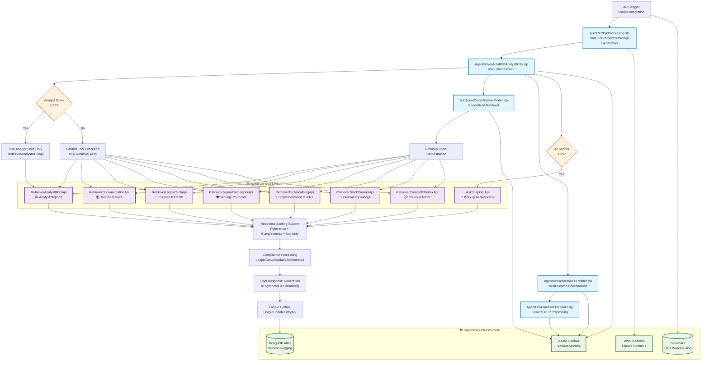

# SnapLogic RFP Automation System Documentation

## Overview

The SnapLogic RFP Automation System is an AI-powered enterprise solution that automatically processes Request for Proposal (RFP) and Request for Information (RFI) questionnaires. The system leverages a multi-agent architecture with intelligent data retrieval, scoring algorithms, and seamless integration with the Loopio RFP management platform.

## System Architecture

### Multi-Agent Hierarchy

The system employs a three-tier agent architecture:

1. **Driver Agents** - Orchestrate workflows and coordinate between components
2. **Worker Agents** - Execute specific processing tasks and iterative refinement
3. **Sub-Agents** - Specialize in targeted operations like information retrieval

### Pipeline Relationships and Data Flow



## Pipeline Components

### 1. AutoRFPPreProcessing.slp
**Purpose**: Data preprocessing and prompt enrichment pipeline

**Key Functions**:
- Processes raw RFP questions with metadata
- Uses AWS Bedrock (Claude Sonnet 4) for contextual prompt generation
- Performs data type conversion and structural joins
- Outputs structured CSV data ready for agent processing

**Input**: Raw RFP questionnaire data
**Output**: Enriched, categorized questions with AI-generated prompts

### 2. AgentDriverAutoRFPAnalystRFIs.slp
**Purpose**: Primary orchestrator for the entire RFX response process

**Key Functions**:
- Coordinates between retrieval sub-agents and worker agents
- Implements intelligent decision logic based on analyst data scores
- Processes compliance questions via `LoopioGetComplianceOptionsApi`
- Updates final responses via `LoopioUpdateEntryApi`
- Manages project context (Project ID: 1126549, "sandbox 3")

**Decision Logic**:
- If `RetrieverAnalystRFIsApi` score ≥ 25: Use analyst data exclusively
- If score < 25: Execute all retrieval tools in parallel
- Fallback to `AskSnapGptApi` when all scores ≤ 25

### 3. SubAgentDriverAnswerFinder.slp
**Purpose**: Specialized information gathering and synthesis sub-agent

**Key Functions**:
- Executes targeted retrieval operations
- Implements parallel tool execution for comprehensive data gathering
- Applies sophisticated scoring algorithms for source selection
- Synthesizes information from multiple authoritative sources

### 4. AgentWorkerAutoRFPRefiner.slp
**Purpose**: Multi-search coordination and iterative response refinement

**Key Functions**:
- Coordinates parallel execution of all retrieval tools
- Implements comprehensive scoring across all data sources
- Performs iterative refinement of generated responses
- Optimizes response quality through multiple AI model interactions

### 5. AgentDriverAutoRFPRefiner.slp
**Purpose**: General RFP refinement and processing coordination

**Key Functions**:
- Provides general-purpose RFP processing capabilities
- Coordinates with worker agents for complex refinement tasks
- Implements quality assurance and validation logic
- Manages response formatting and compliance requirements

### 6. ApiTriggerLoopioAnalystRfi.slp  
**Purpose**: API trigger for Loopio integration and workflow coordination

**Key Functions**:
- Handles external API triggers from Loopio platform
- Manages workflow initiation and coordination
- Integrates with Snowflake for data warehousing
- Provides monitoring and audit trail capabilities

## Data Retrieval Architecture

### Primary Retrieval Tools

| Tool | Purpose | Priority | Data Source |
|------|---------|----------|-------------|
| `RetrieverAnalystRFIsApi` | Analyst reports (Gartner, Aragon) | **HIGHEST** | Industry research |
| `RetrieverDocumentationApi` | Official technical documentation | High | Product documentation |
| `RetrieverSigmaFrameworkApi` | Enterprise security protocols | High | Security frameworks |
| `RetrieverLoopioTechApi` | Curated RFP answers database | Medium | Previous responses |
| `RetrieverTechnicalBlogApi` | Implementation guides | Medium | Technical content |
| `RetrieverSlackCrawlerApi` | Internal tribal knowledge | Medium | Internal communications |
| `RetrieverCuratedRfiIndexApi` | Library of previous RFPs | Low | Historical data |
| `AskSnapGptApi` | Backup AI response generation | **FALLBACK** | AI synthesis |

### Retrieval Decision Matrix

The system employs intelligent source selection based on content quality:

```
┌─────────────────────────────────────────────────────────────┐
│                    Retrieval Decision Logic                 │
├─────────────────────────────────────────────────────────────┤
│ Analyst Score ≥ 25    → Use Analyst Data Only              │
│ Analyst Score < 25    → Execute All 6 Tools in Parallel    │
│ All Scores ≤ 25       → Fallback to AskSnapGPT             │
└─────────────────────────────────────────────────────────────┘
```

## Scoring System

### Multi-Dimensional Scoring Algorithm

Each retrieved response is evaluated across three dimensions:

- **Relevance** (0-10): How well the content addresses the specific RFP question
- **Completeness** (0-10): Whether the response provides comprehensive coverage
- **Authority** (0-10): The credibility and reliability of the source

**Total Score Range**: 0-30 points

### Score-Based Decision Making

- **High Quality (25-30)**: Use response as primary source
- **Medium Quality (15-24)**: Combine with other sources
- **Low Quality (0-14)**: Require additional retrieval or fallback processing

## AI Model Integration

### AWS Bedrock Integration
- **Model**: Claude Sonnet 4
- **Usage**: Data preprocessing, prompt enrichment
- **Capabilities**: Advanced reasoning, context understanding

### Azure OpenAI Integration  
- **Models**: Various OpenAI models
- **Usage**: Response generation, refinement, synthesis
- **Features**: Function calling, tool integration

## External System Integrations

### Loopio Platform
- **API Endpoints**:
  - `LoopioGetComplianceOptionsApi`: Retrieve compliance question options
  - `LoopioUpdateEntryApi`: Update entries with generated responses
- **Authentication**: Account-based with role separation
- **Data Flow**: Bidirectional integration for question retrieval and answer submission

### MongoDB Atlas
- **Purpose**: Session logging, performance tracking, audit trails
- **Data Stored**: Pipeline execution logs, response quality metrics, user interactions
- **Monitoring**: Real-time performance analysis and system health

### Snowflake Data Warehouse
- **Purpose**: Long-term data storage and analytics
- **Integration**: Via ApiTriggerLoopioAnalystRfi pipeline
- **Analytics**: Historical response analysis, system performance metrics

## Compliance and Security

### Compliance Processing
- Automated compliance option retrieval and selection
- Context-aware decision making for regulatory requirements
- Audit trail maintenance for all processing activities

### Security Features
- Account-based authentication with role separation
- Secure API endpoints with HTTPS encryption
- Data privacy protection throughout the processing pipeline

## Performance Optimization

### Parallel Processing
- Simultaneous execution of multiple retrieval tools
- Concurrent AI model invocations for faster response times
- Optimized resource utilization across the SnapLogic platform

### Caching Strategy
- Pipeline result caching for frequently requested content
- Response caching to improve system responsiveness
- Intelligent cache invalidation based on data freshness

### Error Handling
- Comprehensive failure recovery mechanisms
- Graceful degradation when components are unavailable
- Retry logic for transient failures

## Monitoring and Analytics

### Real-Time Monitoring
- Pipeline execution status tracking
- Response quality metrics monitoring
- System performance analytics

### Key Performance Indicators (KPIs)
- Average response generation time
- Response quality scores by source
- System availability and reliability metrics
- User satisfaction scores

## Deployment and Operations

### Environment Configuration
- **Base URL**: `https://prodeu-connectfasterinc-cloud-fm.emea.snaplogic.io/service/snapLogic4snapLogic/6.0`
- **Project Context**: Project ID 1126549, "sandbox 3" environment
- **Author**: jarcega@snaplogic.com

### Operational Modes
- **Production Mode**: Full automation with comprehensive logging
- **Debug Mode**: Enhanced logging and step-by-step tracking
- **Validation Mode**: Pipeline validation and testing capabilities

## Future Enhancements

### Planned Improvements
- Enhanced AI model integration for improved response quality
- Extended data source integration for broader knowledge coverage
- Advanced analytics and reporting capabilities
- Improved user interface for system monitoring and control

### Scalability Considerations
- Horizontal scaling capabilities for increased processing volume
- Enhanced caching mechanisms for improved performance
- Advanced load balancing for optimal resource utilization